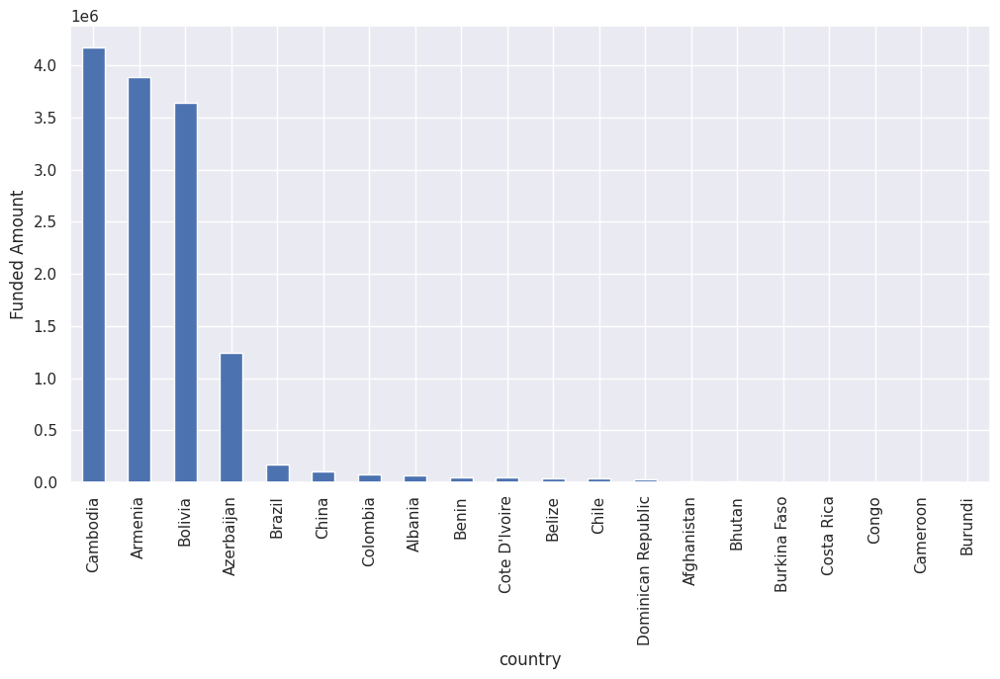
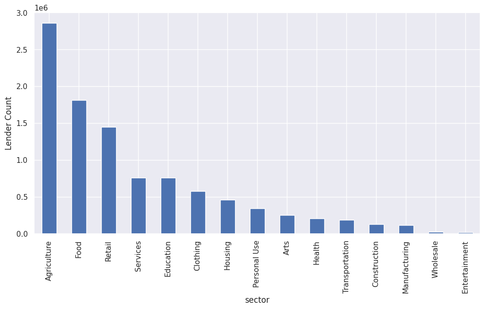
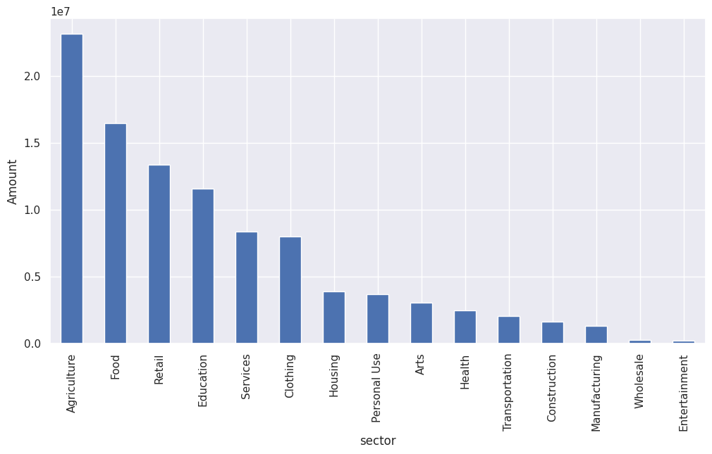

# Kiva Loan Analysis Project

## Overview
This repository contains the code and analysis conducted as part of the Kiva Loan Analysis project. The project aims to analyze loan data from Kiva.org to gain insights into borrower repayment, funding distribution across countries and sectors, and the relationship between lender participation and loan amounts.

## Contents
- **kiva_crowdfunding.ipynb**: Jupyter Notebook containing the Python code and analysis conducted on the loan data.
- **data/**: Directory containing the dataset used for the analysis.
- **output/**: Directory containing the images that were generated during data analysis.
- **README.md**: This file providing an overview of the project repository.

## Analysis
The analysis conducted includes:
- Determining borrower loan repayment status.
- Analyzing loan distribution by country and identifying countries receiving the highest and lowest loan amounts.

- Investigating lender participation across countries and sectors.

- Examining loan distribution across sectors and identifying sectors receiving the highest and lowest loan amounts.


## Usage
1. Clone the repository to your local machine using the following command:
   ```
   git clone https://github.com/your-username/kiva-loan-analysis.git
   ```
2. Navigate to the project directory:
   ```
   cd kiva_crowdfunding_project
   ```
3. Open and run the `kiva_crowdfunding.ipynb` notebook using Jupyter Notebook or JupyterLab to view the analysis and results.

## Requirements
- Python 3
- Jupyter Notebook or JupyterLab
- Pandas, NumPy, Matplotlib, Scipy & Seaborn (Python libraries)

## Credits
This project was completed as part of a data analysis task.

## License
This project is licensed under the [MIT License](LICENSE). Feel free to use the code and analysis for your own projects.